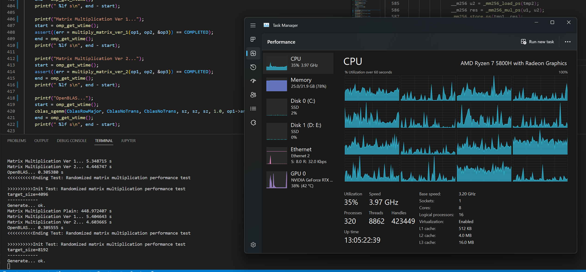
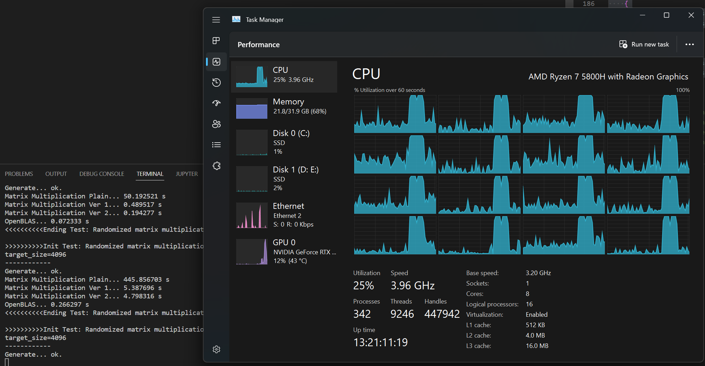

# CS205 C/C++ Programming - Lab Project 4 - Optimization of Matrix Multiplication

**Name**: FANG Jiawei

**SID**: 12110804

## Part 0 - Link
[IskXCr/CS205-Project-4-Matrix-Multiplication](https://github.com/IskXCr/CS205-Project-4-Matrix-Multiplication)


## Part 1 - Bug Fixes and Minor Improvements on Project 3
1. Naive for-loop for initializing elements of the float array to zero are kept, in order to let the compiler optimize this (Which is more efficient than manually implement an algorithm by myself. Also it is therefore possible to enable platform-dependent optimization without manually profiling for each platform).
2. Removed global linked list for thread safety. Added atomic reference count to avoid accidental freeing on the matrix array.
```c
    atomic_size_t refs; /* Reference to this matrix */
```
3. Fixed loop order in matrix multiplication to avoid tranposing the result. Now the program only tranposes ``op2`` to optimize access speed.
4. Use ``omp_get_wtime()`` as the appropriate timer.
5. Improved ``matrix_errno`` for reporting various kind of errors occurred in matrix operations.
6. Optimized language: use *sequential access* instead of *linear access*.

## Part 2 - Major Improvements on Matrix Multiplication
1. (*Already implemented*) transposing the second matrix for sequential read of the elements in matrix.
2. Used cache-oblivious algorithm for transposing a matrix (divide-and-conquer approach). The time taken to transpose a ``8192*8192`` matrix is about ``0.01s``. The space complexity is ``O(n^3)``  since a new matrix is allocated.
3. Used ``omp parallel for simd`` to parallelize the execution of unrelated calculations.
4. Used ``omp simd reduction`` to automatically adapt to different platforms for SIMD execution.
5. Manually optimized using ``AVX2`` instructions to reduce execution time. They are applied only when compiler defines ``__AVX2__``.
6. Align ``float[]`` to a 32-byte boundary upon creation for ``SIMD`` instructions.

## Part 3 - Automated Tests

This test run has been conducted multiple times before the formal one begins.

The test platform has the following specs:

```
CPU: AMD Ryzen 7 5800H 8C/16T @4.00GHz
Memory: 32GiB DDR4 3200MHz SODIMM
```

The following table illustrates performance data extracted from the formal test. Each size has been tested three times and the average is taken.

| #Test | Size  | ``Plain``          | ``Ver_1``  | ``Ver_2``  | OpenBLAS  | Description                                     |
| ----- | ----- | ------------------ | ---------- | ---------- | --------- | ----------------------------------------------- |
| 1     | 16    | 0.000002           | 0.001284   | 0.000987   | 0.000192  |                                                 |
| 2     | 32    | 0.000038           | 0.000252   | 0.000255   | 0.000006  |                                                 |
| 3     | 64    | 0.000168           | 0.000463   | 0.000275   | 0.000024  |                                                 |
| 4     | 128   | 0.002535           | 0.010074   | 0.021996   | 0.021976  |                                                 |
| 5     | 256   | 0.028042           | 0.020736   | 0.017408   | 0.024579  |                                                 |
| 6     | 512   | 0.322191           | 0.011349   | 0.003514   | 0.017403  |                                                 |
| 7     | 1024  | 3.912341           | 0.080605   | 0.018518   | 0.066544  |                                                 |
| 8     | 2048  | 49.700847          | 0.560149   | 0.168389   | 0.092353  |                                                 |
| 9     | 4096  | 449.680581         | 5.484534   | 4.522151   | 0.303609  |                                                 |
| 10    | 8192  | More than one hour | 53.498805  | 51.450905  | 2.158496  |                                                 |
| 11    | 16384 | More than one hour | 435.454229 | 434.393562 | 15.590444 |                                                 |
| 12    | 65536 | \                  | \          | \          | \         | Process killed (*possibly due to memory limit*) |

* Time measured in seconds.

* To control variables, each group of test contains four different multiplications on the same data.
* ``Plain`` multiplication uses the naïve approach. ``Ver_1`` transposes the second matrix and add ``parallel for simd`` preprocessor directives. ``Ver_2`` uses a divide-and-conquer approach to transpose the matrix and, based on ``Ver_1``, manually tuned SIMD instructions (``AVX2``), ``simd reduction`` directives to reduce time.

On smaller matrices plain multiplication is faster. (Due to the fact that all the data can be saved in the cache).

On large matrices (128-2048) ``Ver_2`` is occasionally faster than ``OpenBLAS``. 

On larger matrices (2048-Up) ``OpenBLAS`` is significantly faster. ``Plain`` multiplication is ignored when ``target_size>=4096``, due to the fact that it takes more than one hour.

Below the automated test results are given. Build the project and execute ``test`` to see the results on a specific platform.

```shell
iskxcr@ISK-WKST:~/CS205-Project-4-Matrix-Multiplication$ ./test 
>>>>>>>>>>Init Test: struct test
parameter test ok.
property test ok.
copy test ok.
reference and deletion test ok.
<<<<<<<<<<Ending Test: struct test

>>>>>>>>>>Init Test: read test
simple string read ok.
string read property test ok.
string read parameter test ok.
stream write ok.
stream read parameter test ok.
stream read element test ok.
<<<<<<<<<<Ending Test: read test

>>>>>>>>>>Init Test: write test
write sample ok.
write verification ok.
<<<<<<<<<<Ending Test: write test

>>>>>>>>>>Init Test: EMMA on matrices test
matrix addition test ok.
matrix subtraction test ok.
<<<<<<<<<<Ending Test: EMMA on matrices test

>>>>>>>>>>Init Test: EMMA on matrix and scalar test
scalar multiplication test ok.
result writing test ok.
scalar addition test ok.
scalar subtraction test ok.
<<<<<<<<<<Ending Test: EMMA on matrix and scalar test completed. 

>>>>>>>>>>Init Test: MIN-MAX test
minimum test ok.
maximum test ok.
<<<<<<<<<<Ending Test: MIN-MAX test

>>>>>>>>>>Init Test: Matrix multiplication test
transpose test ok.
muliplcation test ok.
<<<<<<<<<<Ending Test: Matrix multiplication test

>>>>>>>>>>Init Test: Randomized matrix multiplication performance test
target_size=16
------------
Generate... ok.
Matrix Multiplication Plain... 0.000002 s
Matrix Multiplication Ver 1... 0.001464 s
Matrix Multiplication Ver 2... 0.000412 s
OpenBLAS... 0.000561 s
<<<<<<<<<<Ending Test: Randomized matrix multiplication performance test

>>>>>>>>>>Init Test: Randomized matrix multiplication performance test
target_size=16
------------
Generate... ok.
Matrix Multiplication Plain... 0.000003 s
Matrix Multiplication Ver 1... 0.000286 s
Matrix Multiplication Ver 2... 0.002348 s
OpenBLAS... 0.000011 s
<<<<<<<<<<Ending Test: Randomized matrix multiplication performance test

>>>>>>>>>>Init Test: Randomized matrix multiplication performance test
target_size=16
------------
Generate... ok.
Matrix Multiplication Plain... 0.000002 s
Matrix Multiplication Ver 1... 0.002101 s
Matrix Multiplication Ver 2... 0.000182 s
OpenBLAS... 0.000005 s
<<<<<<<<<<Ending Test: Randomized matrix multiplication performance test

>>>>>>>>>>Init Test: Randomized matrix multiplication performance test
target_size=32
------------
Generate... ok.
Matrix Multiplication Plain... 0.000019 s
Matrix Multiplication Ver 1... 0.000218 s
Matrix Multiplication Ver 2... 0.000175 s
OpenBLAS... 0.000007 s
<<<<<<<<<<Ending Test: Randomized matrix multiplication performance test

>>>>>>>>>>Init Test: Randomized matrix multiplication performance test
target_size=32
------------
Generate... ok.
Matrix Multiplication Plain... 0.000018 s
Matrix Multiplication Ver 1... 0.000309 s
Matrix Multiplication Ver 2... 0.000140 s
OpenBLAS... 0.000006 s
<<<<<<<<<<Ending Test: Randomized matrix multiplication performance test

>>>>>>>>>>Init Test: Randomized matrix multiplication performance test
target_size=32
------------
Generate... ok.
Matrix Multiplication Plain... 0.000078 s
Matrix Multiplication Ver 1... 0.000231 s
Matrix Multiplication Ver 2... 0.000449 s
OpenBLAS... 0.000005 s
<<<<<<<<<<Ending Test: Randomized matrix multiplication performance test

>>>>>>>>>>Init Test: Randomized matrix multiplication performance test
target_size=64
------------
Generate... ok.
Matrix Multiplication Plain... 0.000152 s
Matrix Multiplication Ver 1... 0.000478 s
Matrix Multiplication Ver 2... 0.000230 s
OpenBLAS... 0.000017 s
<<<<<<<<<<Ending Test: Randomized matrix multiplication performance test

>>>>>>>>>>Init Test: Randomized matrix multiplication performance test
target_size=64
------------
Generate... ok.
Matrix Multiplication Plain... 0.000202 s
Matrix Multiplication Ver 1... 0.000192 s
Matrix Multiplication Ver 2... 0.000331 s
OpenBLAS... 0.000042 s
<<<<<<<<<<Ending Test: Randomized matrix multiplication performance test

>>>>>>>>>>Init Test: Randomized matrix multiplication performance test
target_size=64
------------
Generate... ok.
Matrix Multiplication Plain... 0.000151 s
Matrix Multiplication Ver 1... 0.000720 s
Matrix Multiplication Ver 2... 0.000263 s
OpenBLAS... 0.000013 s
<<<<<<<<<<Ending Test: Randomized matrix multiplication performance test

>>>>>>>>>>Init Test: Randomized matrix multiplication performance test
target_size=128
------------
Generate... ok.
Matrix Multiplication Plain... 0.002444 s
Matrix Multiplication Ver 1... 0.000434 s
Matrix Multiplication Ver 2... 0.000210 s
OpenBLAS... 0.019676 s
<<<<<<<<<<Ending Test: Randomized matrix multiplication performance test

>>>>>>>>>>Init Test: Randomized matrix multiplication performance test
target_size=128
------------
Generate... ok.
Matrix Multiplication Plain... 0.002693 s
Matrix Multiplication Ver 1... 0.012751 s
Matrix Multiplication Ver 2... 0.014675 s
OpenBLAS... 0.019949 s
<<<<<<<<<<Ending Test: Randomized matrix multiplication performance test

>>>>>>>>>>Init Test: Randomized matrix multiplication performance test
target_size=128
------------
Generate... ok.
Matrix Multiplication Plain... 0.002469 s
Matrix Multiplication Ver 1... 0.017037 s
Matrix Multiplication Ver 2... 0.051104 s
OpenBLAS... 0.025763 s
<<<<<<<<<<Ending Test: Randomized matrix multiplication performance test

>>>>>>>>>>Init Test: Randomized matrix multiplication performance test
target_size=256
------------
Generate... ok.
Matrix Multiplication Plain... 0.030945 s
Matrix Multiplication Ver 1... 0.043872 s
Matrix Multiplication Ver 2... 0.009704 s
OpenBLAS... 0.018724 s
<<<<<<<<<<Ending Test: Randomized matrix multiplication performance test

>>>>>>>>>>Init Test: Randomized matrix multiplication performance test
target_size=256
------------
Generate... ok.
Matrix Multiplication Plain... 0.025681 s
Matrix Multiplication Ver 1... 0.005981 s
Matrix Multiplication Ver 2... 0.023607 s
OpenBLAS... 0.032957 s
<<<<<<<<<<Ending Test: Randomized matrix multiplication performance test

>>>>>>>>>>Init Test: Randomized matrix multiplication performance test
target_size=256
------------
Generate... ok.
Matrix Multiplication Plain... 0.027499 s
Matrix Multiplication Ver 1... 0.012357 s
Matrix Multiplication Ver 2... 0.018914 s
OpenBLAS... 0.022057 s
<<<<<<<<<<Ending Test: Randomized matrix multiplication performance test

>>>>>>>>>>Init Test: Randomized matrix multiplication performance test
target_size=512
------------
Generate... ok.
Matrix Multiplication Plain... 0.324504 s
Matrix Multiplication Ver 1... 0.013453 s
Matrix Multiplication Ver 2... 0.004080 s
OpenBLAS... 0.012324 s
<<<<<<<<<<Ending Test: Randomized matrix multiplication performance test

>>>>>>>>>>Init Test: Randomized matrix multiplication performance test
target_size=512
------------
Generate... ok.
Matrix Multiplication Plain... 0.316960 s
Matrix Multiplication Ver 1... 0.012950 s
Matrix Multiplication Ver 2... 0.003746 s
OpenBLAS... 0.023291 s
<<<<<<<<<<Ending Test: Randomized matrix multiplication performance test

>>>>>>>>>>Init Test: Randomized matrix multiplication performance test
target_size=512
------------
Generate... ok.
Matrix Multiplication Plain... 0.325110 s
Matrix Multiplication Ver 1... 0.007646 s
Matrix Multiplication Ver 2... 0.002716 s
OpenBLAS... 0.016593 s
<<<<<<<<<<Ending Test: Randomized matrix multiplication performance test

>>>>>>>>>>Init Test: Randomized matrix multiplication performance test
target_size=1024
------------
Generate... ok.
Matrix Multiplication Plain... 4.106553 s
Matrix Multiplication Ver 1... 0.085712 s
Matrix Multiplication Ver 2... 0.018609 s
OpenBLAS... 0.058532 s
<<<<<<<<<<Ending Test: Randomized matrix multiplication performance test

>>>>>>>>>>Init Test: Randomized matrix multiplication performance test
target_size=1024
------------
Generate... ok.
Matrix Multiplication Plain... 3.729410 s
Matrix Multiplication Ver 1... 0.089844 s
Matrix Multiplication Ver 2... 0.019022 s
OpenBLAS... 0.078050 s
<<<<<<<<<<Ending Test: Randomized matrix multiplication performance test

>>>>>>>>>>Init Test: Randomized matrix multiplication performance test
target_size=1024
------------
Generate... ok.
Matrix Multiplication Plain... 3.901060 s
Matrix Multiplication Ver 1... 0.066261 s
Matrix Multiplication Ver 2... 0.017923 s
OpenBLAS... 0.063050 s
<<<<<<<<<<Ending Test: Randomized matrix multiplication performance test

>>>>>>>>>>Init Test: Randomized matrix multiplication performance test
target_size=2048
------------
Generate... ok.
Matrix Multiplication Plain... 48.331995 s
Matrix Multiplication Ver 1... 0.568309 s
Matrix Multiplication Ver 2... 0.175431 s
OpenBLAS... 0.075457 s
<<<<<<<<<<Ending Test: Randomized matrix multiplication performance test

>>>>>>>>>>Init Test: Randomized matrix multiplication performance test
target_size=2048
------------
Generate... ok.
Matrix Multiplication Plain... 52.204992 s
Matrix Multiplication Ver 1... 0.561974 s
Matrix Multiplication Ver 2... 0.166094 s
OpenBLAS... 0.062448 s
<<<<<<<<<<Ending Test: Randomized matrix multiplication performance test

>>>>>>>>>>Init Test: Randomized matrix multiplication performance test
target_size=2048
------------
Generate... ok.
Matrix Multiplication Plain... 48.565556 s
Matrix Multiplication Ver 1... 0.550165 s
Matrix Multiplication Ver 2... 0.163642 s
OpenBLAS... 0.139154 s
<<<<<<<<<<Ending Test: Randomized matrix multiplication performance test

>>>>>>>>>>Init Test: Randomized matrix multiplication performance test
target_size=4096
------------
Generate... ok.
Matrix Multiplication Plain... 449.915587 s
Matrix Multiplication Ver 1... 5.609583 s
Matrix Multiplication Ver 2... 4.670519 s
OpenBLAS... 0.330666 s
<<<<<<<<<<Ending Test: Randomized matrix multiplication performance test

>>>>>>>>>>Init Test: Randomized matrix multiplication performance test
target_size=4096
------------
Generate... ok.
Matrix Multiplication Plain... 449.568081 s
Matrix Multiplication Ver 1... 5.441018 s
Matrix Multiplication Ver 2... 4.413121 s
OpenBLAS... 0.327492 s
<<<<<<<<<<Ending Test: Randomized matrix multiplication performance test

>>>>>>>>>>Init Test: Randomized matrix multiplication performance test
target_size=4096
------------
Generate... ok.
Matrix Multiplication Plain... 449.558077 s
Matrix Multiplication Ver 1... 5.403003 s
Matrix Multiplication Ver 2... 4.482815 s
OpenBLAS... 0.252670 s
<<<<<<<<<<Ending Test: Randomized matrix multiplication performance test

>>>>>>>>>>Init Test: Randomized matrix multiplication performance test
target_size=8192
------------
Generate... ok.
Matrix Multiplication Plain... Skipped due to processing time being longer than one hour.
Matrix Multiplication Ver 1... 53.830322 s
Matrix Multiplication Ver 2... 51.589903 s
OpenBLAS... 2.316294 s
<<<<<<<<<<Ending Test: Randomized matrix multiplication performance test

>>>>>>>>>>Init Test: Randomized matrix multiplication performance test
target_size=8192
------------
Generate... ok.
Matrix Multiplication Plain... Skipped due to processing time being longer than one hour.
Matrix Multiplication Ver 1... 53.942201 s
Matrix Multiplication Ver 2... 51.901358 s
OpenBLAS... 1.994039 s
<<<<<<<<<<Ending Test: Randomized matrix multiplication performance test

>>>>>>>>>>Init Test: Randomized matrix multiplication performance test
target_size=8192
------------
Generate... ok.
Matrix Multiplication Plain... Skipped due to processing time being longer than one hour.
Matrix Multiplication Ver 1... 52.723893 s
Matrix Multiplication Ver 2... 51.671454 s
OpenBLAS... 2.165156 s
<<<<<<<<<<Ending Test: Randomized matrix multiplication performance test

Evaluation result: all tests passed.
Time elapsed: 1871.459223 s
```

```shell
iskxcr@ISK-WKST:~/CS205-Project-4-Matrix-Multiplication$ ./test

>>>>>>>>>>Init Test: Randomized matrix multiplication performance test
target_size=16384
------------
Generate... ok.
Matrix Multiplication Plain... Skipped due to processing time being longer than one hour.
Matrix Multiplication Ver 1... 440.880599 s
Matrix Multiplication Ver 2... 436.684454 s
OpenBLAS... 16.111673 s
<<<<<<<<<<Ending Test: Randomized matrix multiplication performance test

>>>>>>>>>>Init Test: Randomized matrix multiplication performance test
target_size=16384
------------
Generate... ok.
Matrix Multiplication Plain... Skipped due to processing time being longer than one hour.
Matrix Multiplication Ver 1... 432.533472 s
Matrix Multiplication Ver 2... 433.088255 s
OpenBLAS... 14.751713 s
<<<<<<<<<<Ending Test: Randomized matrix multiplication performance test

>>>>>>>>>>Init Test: Randomized matrix multiplication performance test
target_size=16384
------------
Generate... ok.
Matrix Multiplication Plain... Skipped due to processing time being longer than one hour.
Matrix Multiplication Ver 1... 432.948618 s
Matrix Multiplication Ver 2... 433.407977 s
OpenBLAS... 15.907946 s
<<<<<<<<<<Ending Test: Randomized matrix multiplication performance test

Evaluation result: all tests passed.
Time elapsed: 2667.916267 s
```

```shell
>>>>>>>>>>Init Test: Randomized matrix multiplication performance test
target_size=65536
------------
Killed
```

### Important code:

#### Plain

```c
/* This function multiplies two matrices in a plain way.

   Multiply two matrices and store the result in a third matrix.
   The result matrix can refer to either op1 or op2 at the same time, but the pointer to the result matrix cannot be NULL.
   All operands, including the result, are supposed to be NULL or valid (i.e. created using function create_matrix()), so that an invalid pointer won't be dereferenced.
   If not, undefined behaviour will occur. If the result matrix isn't able to store the sum, i.e., either it is NULL or the size doesn't match, the result matrix would be modified to match the need.

   If errors occurred during the operation (for example, operand size unmatches), do nothing on the result matrix.

   Returns the corresonding errno code upon failure. */
matrix_errno multiply_matrix_plain(const matrix op1, const matrix op2, matrix *result)
{
    if (op1 == NULL || op2 == NULL)
        return OP_NULL_PTR;

    size_t r_rows = op1->rows; /* number of rows in the result matrix */
    size_t r_cols = op2->cols; /* number of columns in the result matrix */

    if (op1->cols != op2->rows)
        return OP_UNMATCHED_SIZE;

    if (!_is_param_valid(r_rows, r_cols))
        return OP_EXCEEDED_SIZE;

    float *newarr; /* Used to store the intermediate result */

    /* If result is NULL */
    if (*result == NULL)
    {
        if ((*result = create_matrix(r_cols, r_rows)) == NULL) /* If failed to create a new matrix */
        {
            out_of_memory();
            return OUT_OF_MEMORY;
        }
        else
            newarr = (*result)->arr;
    }
    /* Else prepare the result array */
    else if ((newarr = (float *)aligned_alloc(32, (r_rows * r_cols) * sizeof(float))) == NULL)
    {
        out_of_memory();
        return OUT_OF_MEMORY;
    }

    /* Start multiplication */

    size_t c_cnt = op1->cols; /* Cycle count */

    // plain matrix multiplication

    for (size_t i = 0; i < op1->rows; ++i)
    {
        for (size_t j = 0; j < op2->cols; ++j)
        {
            float result = 0;
            for (size_t k = 0; k < op1->cols; ++k)
            {
                result += op1->arr[i * c_cnt + k] * op2->arr[k * op2->cols + j];
            }
            newarr[i * r_cols + j] = result;
        }
    }

    /* Clean up */
    (*result)->rows = r_cols;
    (*result)->cols = r_rows;
    if ((*result)->arr != newarr)
    {
        free((*result)->arr);
        (*result)->arr = newarr;
    }

    return COMPLETED;
}

```

#### SIMD Optimization

```c
/* Horizontally sum a __m256 which stores 8 packed 32-bit precision fp */
static inline float _mm256_hsum(__m256 a)
{
    __m256 t1 = _mm256_hadd_ps(a, a);
    __m256 t2 = _mm256_hadd_ps(t1, t1);
    __m128 t3 = _mm256_extractf128_ps(t2, 1);
    __m128 t4 = _mm_add_ss(_mm256_castps256_ps128(t2), t3);
    return _mm_cvtss_f32(t4);
}

/* Multiplying two matrices A (m * n) and B (n * k) where B is **tranposed**, and store the result in C.
   A, B, C **must** be aligned on a 32-byte boundary. */
static void
_matrix_mul(float *A, float *B, float *C, int m, int n, int k)
{
    // implemented: transposed matrices (trans2, result) for faster access speed, loop designed to access elements sequentially
    const size_t blk_size = 64 / sizeof(float); // 64 == common cache line size

#pragma omp parallel for simd
    for (size_t i = 0; i < m; ++i)
    {
        for (size_t u = 0; u < k; ++u)
        {
            float result = 0.0f;
//==============
#ifdef __AVX2__
            float rst[8] = {};
            __m256 r0 = _mm256_loadu_ps(rst);
            size_t j;
            for (j = 0; j < n - 7; j += 8)
            {
                __m256 u1 = _mm256_loadu_ps(A + i * n + j);
                __m256 u2 = _mm256_loadu_ps(B + u * n + j);
                __m256 r1 = _mm256_mul_ps(u1, u2);
                r0 = _mm256_add_ps(r0, r1);
            }
            if (j != n)
            {
                if (n >= 8)
                {
                    result += _mm256_hsum(r0);
                }
                float *tmp1 = (float *)aligned_alloc(32, 8 * sizeof(float));
                float *tmp2 = (float *)aligned_alloc(32, 8 * sizeof(float));
                memcpy(tmp1, A + i * n + j, (n - j) * sizeof(float));
                memcpy(tmp2, B + u * n + j, (n - j) * sizeof(float));
                __m256 u1 = _mm256_load_ps(tmp1);
                __m256 u2 = _mm256_load_ps(tmp2);
                __m256 res = _mm256_mul_ps(u1, u2);
                _mm256_store_ps(tmp1, res);
                for (int i = 0; i < n - j; ++i)
                    result += tmp1[i];
                free(tmp1);
                free(tmp2);
            }
#else
#pragma omp simd reduction(+ \
                           : result)
            for (size_t j = 0; j < n; ++j)
            {
                result += A[i * n + j] * B[u * n + j];
            }
#endif
            C[i * k + u] = result;
        }
    }
}
```

#### Divide-and-conquer Transpose

```c
// Threshold for primitive tranposing.
#define _MAT_TRANS_THRESHOLD 8U

/* Cache-oblivious function for recursively transposing a matrix */
static void
_transpose_mat(float *src, float *dest, size_t r_offset, size_t c_offset,
               size_t src_rows, size_t src_cols, size_t rows, size_t cols)
{
    if (rows <= _MAT_TRANS_THRESHOLD && cols <= _MAT_TRANS_THRESHOLD)
    {
        for (size_t i = r_offset; i < r_offset + rows; ++i)
            for (size_t j = c_offset; j < c_offset + cols; ++j)
                dest[j * src_rows + i] = src[i * src_cols + j];
        return;
    }

    /* Cut the larger dimension in half. Cut rows first. */
    if (rows >= cols)
    {
        _transpose_mat(src, dest, r_offset, c_offset, src_rows, src_cols, rows / 2, cols);
        _transpose_mat(src, dest, r_offset + rows / 2, c_offset, src_rows, src_cols, rows - rows / 2, cols);
    }
    else
    {
        _transpose_mat(src, dest, r_offset, c_offset, src_rows, src_cols, rows, cols / 2);
        _transpose_mat(src, dest, r_offset, c_offset + cols / 2, src_rows, src_cols, rows, cols - cols / 2);
    }
}
```

* Here ``8U`` is tested to be the best choice on author's platform.

## Part 4 - Analysis

1. Simply transposing the second matrix shortened execution time to 1%.

2. Hand tuning the block multiplication and loop unrolling will have better efficiency, but requires a great amount of work for each target platform.

3. Utilizing cache access **only** is more efficient than writing a complicated algorithm **only**. 

   As the reader may notice, the performance bottleneck for the plain matrix multiplication is not CPU.

   

   For comparison, the CPU usage when ``Ver_2`` multiplication is being used is shown below.

   

   * Two intervals with full utilization of CPU in the graph are due to the optimized matrix multiplication and ``OpenBLAS``.

4. Block matrix multiplication actually accelerates the calculation by utilizing cache through loading the same data and reuse them multiple times, but the difference between with this blocking and without them under ``-O3`` (which includes ``-ftree-vectorizer-verbose``) is not noticeable on author's platform, however the code is more complicated. It may be due to the implementation fault.

5. If it is impossible to optimize for all those common platforms, write simple code and let the compiler do optimization job. ``OpenMP`` provides simple preprocessor directives for handling this. However, ``gcc`` is observed to not vectorize multiplication sometimes, requiring hand tuning.

   ``add_compile_options(-march=native -funroll-loops -O3 -fopt-info-vec-missed)``

   ```c
   #else
   #pragma omp simd reduction(+ \
                              : result)
               for (size_t j = 0; j < n; ++j)
               {
                   result += A[i * n + j] * B[u * n + j];
               }
   #endif
               C[i * k + u] = result;
   ```

6. When the matrix is small, the cost for plain matrix multiplication is **significantly lower**, meaning that for some small matrices it would be better to choose the plain approach. In practice, it is a **must** to use different approaches on inputs with different size. Using ``gprof`` and compile/link with option ``-pg`` the author found that function calls in divide-and-conquering process and multi-threading cost take account for most of the time used.

## Part 5 - References

1. [Use gprof with cmake]([profiling - How to use gprof with cmake - Stack Overflow](https://stackoverflow.com/questions/26491948/how-to-use-gprof-with-cmake))
2. Ulrich Drepper - What Every Programmer Should Know About Memory
3. Cornell University Lecture Slide - Tiling matrix-matrix multiply, code tuning
4. Various websites about matrix multiplication.